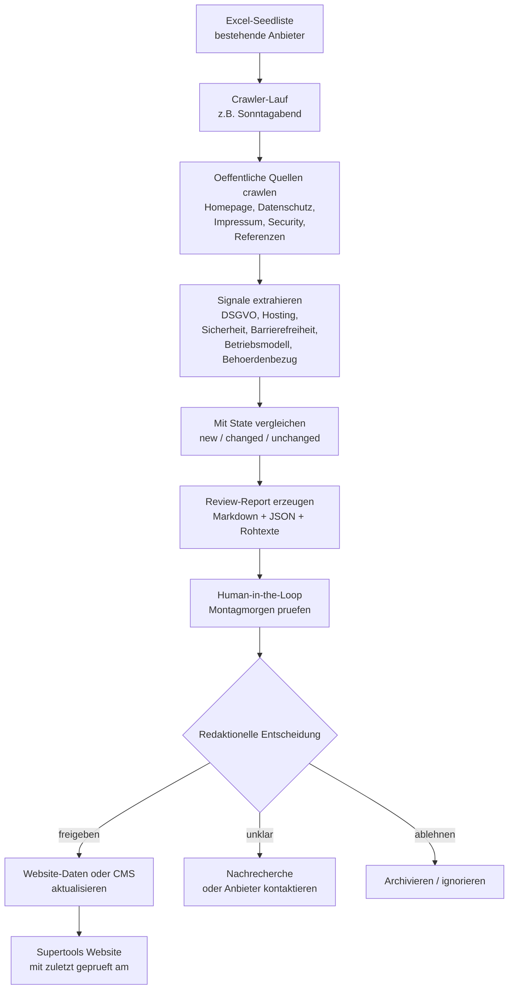

# Crawler-Prozess

```mermaid
flowchart TD
  A["Excel-Seedliste<br/>bestehende Anbieter"] --> B["Crawler-Lauf<br/>z.B. Sonntagabend"]

  B --> C["Oeffentliche Quellen crawlen<br/>Homepage, Datenschutz,<br/>Impressum, Security,<br/>Referenzen"]

  C --> D["Signale extrahieren<br/>DSGVO, Hosting,<br/>Sicherheit, Barrierefreiheit,<br/>Betriebsmodell, Behoerdenbezug"]

  D --> E["Mit State vergleichen<br/>new / changed / unchanged"]

  E --> F["Review-Report erzeugen<br/>Markdown + JSON + Rohtexte"]

  F --> G["Human-in-the-Loop<br/>Montagmorgen pruefen"]

  G --> H{"Redaktionelle Entscheidung"}

  H -->|freigeben| I["Website-Daten oder CMS<br/>aktualisieren"]
  H -->|unklar| J["Nachrecherche<br/>oder Anbieter kontaktieren"]
  H -->|ablehnen| K["Archivieren / ignorieren"]

  I --> L["Supertools Website<br/>mit zuletzt geprueft am"]
```
