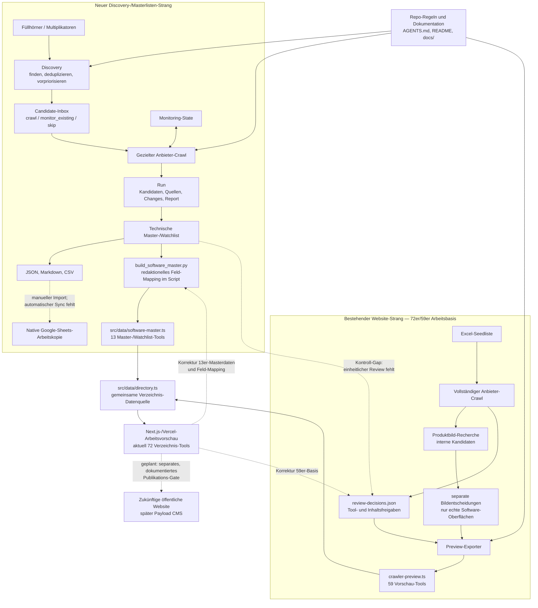

# Supertools: Systemlogik und Qualifizierungsprozess

**Stand:** 15. August 2026
**Zielgruppe:** Julia, Christian, Redaktion, Projektsteuerung und Entwicklung
**Status:** Dokumentation des aktuellen Arbeitsstands; noch kein vollautomatisches Produktionssystem

## Die Kurzfassung

Supertools ist technisch kein Crawler, der gefundene Anbieter automatisch auf
die Website stellt. Es ist ein **redaktionell kontrolliertes Beobachtungs- und
Qualifizierungssystem**:

1. Quellen zeigen, wo interessante Anbieter zu finden sein könnten.
2. Kandidaten werden gesammelt, von Dubletten bereinigt und für den Crawl vorpriorisiert.
3. Der Crawler sammelt öffentlich belegbare Signale und Quellen.
4. Das System sortiert die Ergebnisse in Arbeits- und Prüfstatus.
5. Menschen entscheiden, was fachlich richtig, relevant und veröffentlichbar ist.
6. Im aktuellen Arbeitsstand enthält die interne Vorschau sowohl 59 explizit
   freigegebene als auch 13 nur technisch vorqualifizierte Tools. Vor einem
   öffentlichen Livegang müssen alle Einträge ein einheitliches Review-Gate
   durchlaufen.

Der wichtigste Grundsatz lautet:

> **Automatisch recherchieren und vorsortieren — menschlich bewerten und veröffentlichen.**

Eine technische Vorqualifizierung ist deshalb weder eine Empfehlung noch ein
Qualitätssiegel und noch keine Freigabe für die Website.

---

## 1. Das Gesamtsystem als verständliche Abfolge

**Leseschlüssel:** Durchgezogene Pfeile zeigen heute vorhandene technische
Übergaben. Gestrichelte Pfeile zeigen manuelle Übergaben, noch fehlende
Automatisierung oder den geplanten Zielzustand.

### Der wichtige Status quo: zwei noch nicht vollständig verbundene Stränge

- Der neue Strang vom Multiplikator bis zur Master-/Watchlist ist seit dem
  14.08.2026 lauffähig. Er erzeugt JSON, Markdown und CSV und wird inzwischen
  zusätzlich über `scripts/build_software_master.py` in Frontend-Daten
  übersetzt. Die 13 Master-/Watchlist-Einträge werden in
  `src/data/directory.ts` zur bestehenden Website-Arbeitsbasis ergänzt.
- Der bestehende Website-Strang beruht auf dem vollständigen Excel-Crawl mit
  72 Einträgen. Dort existieren bereits Review-Entscheidungen und 59 für die
  interne Arbeitsvorschau freigegebene Tools.
- Beide Stränge laufen damit bereits in einer gemeinsamen Frontend-Datenquelle
  und aktuell 72 Verzeichnis-Tools zusammen. Sie besitzen aber noch **keinen
  gemeinsamen maschinenlesbaren Review-Prozess**: Der neue Master-Build liest
  `review-decisions.json` nicht ein. Seine redaktionellen Kategorie-/Pitch-
  Zuordnungen liegen derzeit direkt im Build-Script.
- Die Aggregation dedupliziert inzwischen technisch nach Slug. Da die
  Masterdaten zuletzt in das Array einfließen, haben sie bei identischen Slugs
  Vorrang. Ein fachlicher Konflikt-Report und ein einheitliches Review-Gate
  fehlen weiterhin; die technische Deduplizierung ist keine Freigabe.
- Der nächste Integrationsschritt besteht deshalb darin, vor dem gemeinsamen
  Frontend-Build **ein** Review- und Freigabe-Gate einzuziehen, ohne alte
  Freigaben automatisch auf neue oder veränderte Daten zu übertragen.

Der Ablauf besitzt absichtlich zwei verschiedene menschliche Kontrollpunkte:

- **Redaktionelle Datenfreigabe:** Ist die Aussage sachlich belegt und in der
  richtigen Sprache formuliert?
- **Veröffentlichungsfreigabe:** Darf genau dieser Stand öffentlich sichtbar
  werden?

Die zweite Freigabe ist heute noch **kein strukturierter Systemstatus**. Da die
Website noch als interne Arbeitsvorschau behandelt wird, wird eine öffentliche
Veröffentlichung derzeit nicht technisch ausgelöst. Vor dem Livegang braucht es
dafür einen gespeicherten Status, eine benannte verantwortliche Person/Rolle
und einen widerrufbaren Veröffentlichungsweg im CMS.

### Drei Statusstufen, die nicht verwechselt werden dürfen

| Stufe | Was sie aussagt | Was sie erlaubt |
| --- | --- | --- |
| Technisch vorqualifiziert | Der Crawler hat nach den aktuellen Regeln genügend Signale gefunden. Beispiele: `qualified`, `qualified_needs_review`. | Soll: nur Aufnahme in einen internen Arbeitsbestand. Ist-Gap: Der neue Master-Build übernimmt diese 13 Einträge bereits in die interne Website-Arbeitsvorschau, ohne die Review-Datei technisch zu prüfen. |
| Redaktionell für die Arbeitsvorschau freigegeben | Ein Mensch hat Tool bzw. Inhalt in `review-decisions.json` auf `approved` gesetzt. | Reviewed Export und Darstellung in der internen Arbeitsvorschau |
| Für öffentliche Veröffentlichung freigegeben | Projektverantwortliche geben einen konkreten redaktionellen Stand für den Livegang frei. | Künftige Veröffentlichung über ein noch zu definierendes CMS-Gate |

Die bestehenden 59 `approved`-Einträge gehören zur zweiten Stufe. Sie sind
nicht automatisch eine finale Empfehlungsliste und nicht für einen späteren
öffentlichen Livegang pauschal freigegeben.

---

## 2. Prozessmatrix: Was kommt von wo und geht wohin?

| Nr. | Stufe | Eingang: Woher kommt etwas? | Was passiert? | Ergebnis: Wohin geht es? | Entscheidung durch |
| ---: | --- | --- | --- | --- | --- |
| 0 | Arbeitsregeln | Projektentscheidungen, technische Erkenntnisse, redaktionelle Leitplanken | Dauerhafte Regeln werden im Repository festgehalten, damit Menschen und Codex mit demselben Stand arbeiten. | `AGENTS.md`, `README.md`, `Crawler/*.md`, `docs/` | Projektteam; Umsetzung durch Entwicklung/Codex |
| 1 | Füllhörner / Multiplikatoren | Messen, Konferenzen, Awards, Verbände, Plattformen und spätere Such-APIs | Es wird gepflegt, **wo** regelmäßig geeignete Anbieter gefunden werden können. Jahrgänge/Editionen werden getrennt erfasst. | `data/crawler/discovery/multiplier-sources.json` | Redaktion / Research |
| 2 | Discovery | Ausgewählte Multiplikatoren und deren öffentliche Aussteller-, Partner- oder Programmseiten | Links und Namen werden gesammelt, Dubletten zusammengeführt, offensichtliches Rauschen gefiltert und Kandidaten vorpriorisiert. | Discovery-Run unter `data/crawler/discovery/runs/<run-id>/` | Script schlägt vor; Mensch kann korrigieren |
| 3 | Candidate-Inbox | Discovery-Treffer, manuelle Hinweise von Julia/Christian, Partnerhinweise | Jeder konkrete Anbieter erhält einen Status und eine Aktion: crawlen, bestehenden Eintrag beobachten oder überspringen. | `data/crawler/discovery/curation-seeds.json` | Redaktion / Research |
| 4 | Seed-Auswahl | Candidate-Inbox und/oder bestehende Excel-Seedliste | Der konkrete Crawl-Lauf wird nach Quelle, Cluster, Relevanz, Offset und Anzahl begrenzt. | ausgewählte Anbieter für den Lauf | Mensch startet und begrenzt den Lauf |
| 5 | Anbieter-Crawl | Anbieter-Website und wenige priorisierte Unterseiten | Öffentliche Hinweise zu Behördenbezug, Datenschutz, Hosting, Sicherheit, Barrierefreiheit, Betriebsmodell, Referenzen, Verfügbarkeit und Content Pieces werden extrahiert. | Run-Ordner mit JSON, Markdown-Report und Rohtexten | Script |
| 5a | Produktbild-Recherche | Bild-URLs aus Crawl-HTML und gespeicherten Roh-Markdowns | WebP-/PNG-/JPEG-Assets werden nach UI-nahen Begriffen, Größe, Seitenverhältnis und visueller Varianz vorsortiert und ausschließlich intern heruntergeladen. Jeder Treffer bleibt `needs_review`; Marketingseiten-Snapshots sind ausgeschlossen. | `data/crawler/product-images/<run-id>/` mit Manifest, Review-Report und Entscheidungsvorlage | Script schlägt vor; Mensch entscheidet |
| 6 | Monitoring | Aktueller Crawl plus letzter gespeicherter Signalstand | Relevante Signale werden als `new`, `changed` oder `unchanged` verglichen. Standardmäßig wird der State aktualisiert; mit `--no-save-state` entsteht ein Research-/Testlauf ohne State-Änderung. | `changes.json` und ggf. aktualisierter `state/products.json` | Script; Mensch wählt den Laufmodus |
| 7 | Technische Vorqualifizierung | Strukturierte Crawl-Kandidaten | Geordnete Regeln sortieren in `qualified`, Prüf-/Watchlist oder „Evidenz reicht noch nicht“. | `software-master.json`, Kurzreport und CSV | Script; **keine redaktionelle Endentscheidung und keine Ablehnung** |
| 8 | Master-Frontend-Build | `software-master.json` plus manuelle Kategorie-/Pitch-Zuordnung im Script | Alle 13 Master-/Watchlist-Einträge werden in öffentliche Frontend-Felder übersetzt; interne Status/Confidence-Felder bleiben verborgen, Compliance-Flags bewusst leer. Das Script liest die Review-Datei derzeit nicht. | `src/data/software-master.ts` | Script plus redaktionelle Zuordnung im Code; formales Review-Gate fehlt |
| 9 | Arbeitsabgleich | Master-/Watchlist und CSV | Der aktuelle interne Arbeitsstand wird für Nicht-Developer in einer Tabelle sichtbar und abgleichbar. | CSV; die native Google-Sheets-Arbeitskopie existiert bereits | Team; Import aktuell manuell, kontrollierter technischer Sync noch auszubauen |
| 10 | Redaktionelle Prüfung | Review-Report, Evidenz-URLs, Snippets, Produktbild-Kandidaten und offene Felder | Tool, einzelne Inhalte und Produktbilder werden getrennt freigegeben, zurückgestellt, nachrecherchiert, beim Anbieter angefragt oder abgelehnt. Eine Bildfreigabe bestätigt ausdrücklich, dass die tatsächliche Software-Oberfläche zu sehen ist. | `data/crawler/review-decisions.json` für Tools/Inhalte sowie `data/crawler/product-images/review-decisions.json` für Bilder; Anschluss der neuen Masterliste noch offen | Mensch |
| 11 | Bestehender Preview-Export | Excel-Crawl-Daten plus Tool-/Inhalts- und Bildentscheidungen | Der Exporter übersetzt die 59 `approved`-Tools und freigegebene Inhalte in Frontend-Strukturen. Bilder werden nur mit separatem `approved` und vorhandenem `public_path` übernommen; der Exporter erzeugt selbst keine Viewport-Screenshots. Ohne Review-Datei entsteht nur eine technische Arbeitsvorschau. | `src/mocks/tools/crawler-preview.ts`; freigegebene UI-Bilder unter `public/brand/screenshots/<slug>/` | Script nach menschlichen Review-Entscheidungen |
| 12 | Verzeichnis-Aggregation | 59 bestehende Vorschau-Tools plus 13 neue Master-/Watchlist-Tools | Beide Datenmengen werden zusammengeführt und nach Slug dedupliziert; bei identischen Slugs hat der später geladene Masterdatensatz technisch Vorrang. | `src/data/directory.ts`; derzeit 72 Tool-Karten für Kategorien/Profile und Teile der Startseite | Script/Frontend; einheitliches Review- und fachliches Konflikt-Gate fehlt |
| 13 | Interne Vorschau | Aggregierte Frontend-Daten | Das Team prüft Darstellung, Ton, Kategorien, Quellen und fehlende Informationen. Korrekturen der 59er-Basis gehen in Review-Datei/Quelldaten; Korrekturen der 13 neuen Tools derzeit in Masterdaten bzw. `EDITORIAL`-Mapping. | intern genutzte, per URL erreichbare Vercel-Arbeitsvorschau | Redaktion / Projektteam |
| 14 | Öffentliche Veröffentlichung | final geprüfter Vorschau-Stand | Geplanter separater Freigabeschritt mit Rollen, gespeichertem Status und Rollback. Dieser Prozess ist noch nicht implementiert. | später öffentliche Website / Payload CMS | Projektverantwortliche; namentliche Zuordnung offen |

### Was „automatisch“ hier bedeutet

Automatisch bedeutet: Das System kann Informationen finden, strukturieren,
vergleichen und einen Status vorschlagen. Es bedeutet **nicht**, dass Supertools
die Aussage redaktionell übernimmt oder öffentlich empfiehlt.

### Zwei Exportarten nicht verwechseln

Der aktuelle Exporter kann ohne Review-Datei eine **technische Preview** aus
lesbaren Kandidaten mit hoher oder mittlerer Confidence erzeugen. Diese Variante
dient ausschließlich der internen Struktur- und Darstellungsprüfung. Wird
`review-decisions.json` übergeben, exportiert er dagegen nur Tools mit
`approved`; einzelne Content Pieces müssen ebenfalls separat `approved` sein.

Damit gilt organisatorisch: **Eine automatisch erzeugte Preview darf niemals
als Veröffentlichungsfreigabe behandelt werden.**

Für den neuen Master-Zweig gilt zusätzlich: Das Build-Script bezeichnet die
übernommenen Datensätze als redaktionell freigegeben, prüft diesen Status aber
aktuell nicht gegen `review-decisions.json`. Eine mögliche manuelle Prüfung ist
damit nicht maschinenlesbar dokumentiert. Bis zum einheitlichen Gate bleiben
diese 13 Einträge Teil der internen Arbeitsvorschau, nicht einer finalen
öffentlichen Liste.

„Interne Arbeitsvorschau“ beschreibt hier die Nutzung, nicht nachweislich einen
technischen Zugriffsschutz. Im Repository ist keine Vercel-Zugangssperre für
die Preview dokumentiert. Die URL ist daher bis zur Prüfung des Deployments wie
eine potenziell extern erreichbare URL zu behandeln; sensible oder rechtlich
ungeprüfte Inhalte dürfen dort nicht abgelegt werden.

### Zuständigkeiten im aktuellen Arbeitsmodell

| Aufgabe | Zuständige Rolle heute | Noch offen |
| --- | --- | --- |
| Quellen und Candidate-Inbox pflegen | Redaktion / Research | namentlicher Owner und Vertretung |
| Crawls starten, Fehler beheben, Exporte erzeugen | Entwicklung / Codex unter menschlichem Auftrag | fester Betriebsrhythmus und Fehler-Eskalation |
| Evidenz, Tool und einzelne Inhalte bewerten | Redaktion | verbindliche Prüfliste und Freigabeberechtigung |
| Arbeitsvorschau abnehmen | Redaktion und Projektteam | dokumentiertes Abnahmeprotokoll |
| Öffentlichen Livegang freigeben | Projektverantwortliche | Name/Rolle, Speicherort der Entscheidung und Widerruf/Rollback |
| Sheets-/CMS-Synchronisation betreiben | noch nicht produktiv vergeben | technischer Owner, Monitoring und Fehlerbehandlung |

---

## 3. Die drei Listen — und warum sie getrennt bleiben

| Liste | Einfache Übersetzung | Enthält | Enthält ausdrücklich nicht | Aktueller Stand |
| --- | --- | --- | --- | ---: |
| Multiplikatorenliste | „Wo suchen wir?“ | 30 Quellen: 18 Messen und 12 Konferenzen; davon 17 mit hohem und 13 mit mittlerem Public-Sector-Fit | keine freigegebenen Tools | 30 Quellen |
| Candidate-Inbox | „Was sollten wir prüfen?“ | konkrete Anbieter, Dublettenhinweise, Status und Crawl-Aktion | keine Website-Freigabe | 56 Einträge; 17 `crawl`, 5 `monitor_existing`, 34 `skip` |
| Master-/Watchlist | „Wo reicht die Evidenz für eine technische Arbeitsliste oder weitere Beobachtung?“ | eine Datei mit zwei Gruppen: stärkere Master-Kandidaten und Watchlist-Fälle mit weiterem Recherchebedarf; dazu Kriterien, Evidenz-URLs, Verfügbarkeit, Screenshots und Arbeitsstatus | keine öffentliche Empfehlung, kein Qualitätssiegel und keine redaktionelle Freigabe | 13 Master-/Watchlist-Einträge; weitere Fälle mit unzureichender Evidenz bzw. technischem Recrawl bleiben im Lauf dokumentiert |

Die ältere/breitere Website-Arbeitsbasis aus der Excel-Pipeline ist **keine
vierte Discovery-Liste**, sondern ein paralleler, früherer Arbeitsstrang: 72
Einträge in `review-decisions.json`, davon 59 für die interne Arbeitsvorschau
freigegeben und 13 in Nachrecherche. Zusammen mit den 13 neuen Master-/Watchlist-
Einträgen ergibt das aktuell 72 Website-Tools. Diese 72 sind noch keine finale
kuratierte Tool-Liste.

### Wenn ein Anbieter manuell vorgeschlagen wird

Ein manueller Hinweis wird von Redaktion/Research in die Candidate-Inbox
eingetragen. Mindestens benötigt werden Name, Website oder belastbare
Ausgangsquelle sowie die gewünschte Crawl-Aktion. Cluster, Themenhinweis,
Relevanz und Notiz helfen bei der Priorisierung. Die Aktionen bedeuten:

- `crawl`: im nächsten passenden Lauf technisch prüfen;
- `monitor_existing`: vorhandener Eintrag — nicht doppelt anlegen, sondern den
  bestehenden Datensatz beobachten;
- `skip`: vorerst nicht crawlen, etwa bei Rauschen, unklarer Identität oder
  fehlender Quelle. `skip` ist **keine fachliche Ablehnung** und löst ohne eine
  spätere menschliche Änderung keinen automatischen neuen Crawl aus.

---

## 4. Welche öffentlichen Signale der Crawler erfasst

Der Crawler sucht keine abstrakte „Gesamtnote“. Er sammelt getrennte Signale,
damit die Redaktion später nachvollziehen kann, worauf eine Aussage beruht. Er
erkennt und zitiert öffentliche Aussagen; er verifiziert weder deren Wahrheit
noch die rechtliche oder fachliche Eignung eines Produkts.

| Signal | Frage in Alltagssprache | Was als Ergebnis gespeichert wird | Wichtige Grenze |
| --- | --- | --- | --- |
| Public-Sector-Bezug | Arbeitet der Anbieter erkennbar für Behörden oder Verwaltungen? | Treffer, Snippets und Quell-URLs | Eine einzelne Referenz ist noch keine allgemeine Eignung. |
| Datenschutz / DSGVO | Gibt es belastbare öffentliche Datenschutzinformationen? | Signal plus Quelle | Das ist keine juristische Prüfung oder DSGVO-Zertifizierung. |
| Hosting / Serverstandort | Wird Hosting oder ein Standort nachvollziehbar genannt? | Signal, Textausschnitt und Quelle | Firmensitz und Serverstandort dürfen nicht gleichgesetzt werden. |
| Sicherheit | Werden z. B. ISO, BSI, C5 oder andere Sicherheitsangaben genannt? | getrennte Evidenz | Unterschiedliche Standards dürfen nicht pauschal als gleichwertig dargestellt werden. |
| Barrierefreiheit | Gibt es Aussagen zu digitaler Barrierefreiheit? | Signal und Quelle | Marketingaussage ist noch kein unabhängiger Nachweis. |
| Betriebsmodell | Cloud, SaaS, On-Premise oder Hybrid? | erkannte Modelle | Unklare Angaben bleiben offen. |
| Referenzen / Cases | Gibt es nachvollziehbare Projekte oder Fallbeispiele? | Quellen und passende Content Pieces | Referenz vorhanden heißt nicht automatisch erfolgreich evaluiert. |
| Verfügbarkeit | Ist das Angebot bundesweit, bundeslandspezifisch, regional oder unklar verfügbar? | Scope, Regionen, Confidence, Review-Pflicht und Evidenz | Nie allein aus Firmensitz oder einer Einzelreferenz ableiten. |
| Inhalte | Gibt es Videos, Webinare, Cases, Whitepaper, Blogartikel oder Downloads? | Art, Titel, URL, Quelle und ggf. Video-ID | Jeder einzelne Inhalt braucht eine eigene Freigabe. |

Fehlende Informationen bleiben als fehlend sichtbar. Das ist Teil des
Vertrauensmodells und kein technischer Fehler, der durch Vermutungen gefüllt
werden soll.

---

## 5. Wie die technische Vorqualifizierung aktuell entscheidet

Die folgenden Regeln stammen aus der aktuellen Implementierung in
`scripts/build_crawler_masterlist.py`. Sie sind eine **Sortierhilfe**, keine
redaktionelle Bewertung. Die Regeln werden in der gezeigten Reihenfolge
ausgewertet: **Die erste zutreffende Regel gewinnt.** Deshalb landet ein Fall
mit hoher Confidence bereits in `qualified_needs_review`; die Watchlist-Regel
greift erst, wenn die vorherigen Regeln nicht erfüllt wurden.

Die Hilfswerte werden aktuell so berechnet:

- **Confidence `hoch`:** Signale für Public Sector, Datenschutz und Hosting
  sind vorhanden; `mittel`: zwei dieser drei Signale; `offen`: höchstens eines.
- **Fehlende Pflichtinformationen:** Public-Sector-Bezug, Datenschutz, Hosting
  und Betriebsmodell werden separat als fehlend markiert.

| Technischer Status | Aktuelle Regel | Bedeutung für das Team |
| --- | --- | --- |
| `blocked_recrawl` | Keine Anbieter-Seite konnte verwertbar gelesen werden. | Technisch erneut versuchen oder manuell recherchieren. |
| `qualified` | Confidence ist hoch und es fehlen keine definierten Pflichtinformationen. | Sehr guter Kandidat für die redaktionelle Prüfung. |
| `qualified_needs_review` | Confidence hoch, Public-Sector- und Datenschutzsignal vorhanden sowie Hosting **oder** Sicherheit vorhanden; mindestens eine Pflichtinformation fehlt noch. | Starker Kandidat, aber offene Punkte müssen geprüft werden. |
| `watchlist_needs_research` | Public-Sector-, Datenschutz- und Sicherheitssignal vorhanden, Datenlage aber noch nicht vollständig genug. | Beobachten und gezielt nachrecherchieren. |
| `research_or_reject` | Zu wenige belastbare Signale für die Master-/Watchlist. | Evidenz reicht technisch noch nicht; redaktionelle Entscheidung bleibt offen. Dieser Status ist **keine Ablehnung**. |

Auch `qualified` bedeutet nur: **Die Maschine hat im definierten Signalcheck
genug Material gefunden.** Erst `approved` in der Review-Datei ist eine
explizite redaktionelle Freigabe für den Export.

---

## 6. Welche Information dauerhaft wohin gehört

Chats sind Arbeitsgespräche. Sie sind nicht die dauerhafte Systemdokumentation.
Wenn eine Entscheidung nach dem Chat weiter gelten soll, muss sie in die
passende Repo-Ebene übertragen werden.

| Wissensebene | Zweck | Richtiger Ort | Beispiel | Gültigkeit |
| --- | --- | --- | --- | --- |
| Dauerhafte Arbeitsregel für Codex | Legt fest, wie bei Aufgaben in diesem Repository gearbeitet werden muss. | `AGENTS.md`; bei spezialisierten Unterordnern ggf. ein weiteres `AGENTS.md`/`AGENTS.override.md` | „Keine automatische Veröffentlichung aus dem Crawler.“ | Wird von Codex beim Start einer Aufgabe als Projektanweisung geladen. |
| Fachliche Produktentscheidung | Erklärt Menschen, warum Supertools etwas auf eine bestimmte Weise macht. | `README.md`, `Crawler/README.md`, `docs/` | „Masterliste ist kein Gütesiegel.“ | Gilt, bis eine dokumentierte neue Entscheidung sie ersetzt. |
| Wiederholbarer Arbeitsablauf | Beschreibt eine Aufgabe mit festen Schritten und erwartetem Ergebnis. | Skill oder Runbook; kritische Projektregeln zusätzlich im Repo | „Wöchentlichen Crawl prüfen und Report erzeugen.“ | Wiederverwendbar; darf die Repo-Wahrheit nicht duplizieren oder überstimmen. |
| Ausführbare technische Regel | Ist die tatsächliche Maschinenlogik. | `scripts/*.py`, später Backend/CMS-Code, plus Tests | Schwellen für `qualified_needs_review` | Gilt tatsächlich zur Laufzeit. |
| Aktueller Datenstand | Speichert Quellen, Kandidaten, Entscheidungen und Monitoring-Zustand. | versionierte JSON-/CSV-Dateien unter `data/crawler/` | Candidate-Inbox, Masterliste, Review-Entscheidungen | Ändert sich mit Research und Läufen. |
| Beleg eines einzelnen Laufs | Macht nachvollziehbar, was ein Lauf wann gefunden hat. | `data/crawler/**/runs/<run-id>/` | Report, Kandidaten, Changes, Rohtexte | Historischer Snapshot; nicht nachträglich zur Wahrheit umdeuten. |
| Gespräch / Entwurf | Hilft beim Denken, hat aber allein keine dauerhafte Verbindlichkeit. | Codex-Chat | Diskussion über eine neue Kategorie | Flüchtig, bis die Entscheidung ins Repo übertragen ist. |

### Wichtig zu `AGENTS.md` und Skills

- `AGENTS.md` enthält knappe, verbindliche Arbeitsregeln und Verweise auf die
  maßgebliche Dokumentation. Codex liest solche Dateien als Projektanweisungen.
- Fachwissen und Architektur gehören nicht komplett in `AGENTS.md`; lange
  Erklärungen bleiben in `docs/`, damit sie für Menschen lesbar sind.
- Ein Skill ist ein wiederverwendbares Vorgehen für wiederkehrende Aufgaben.
  Er darf auf die Repo-Dokumentation verweisen, aber kritische Entscheidungen
  sollten nicht ausschließlich in einem extern installierten Skill leben.
- Der Code ist bei technischen Details die letzte Wahrheit. Wenn Dokument und
  Code widersprechen, muss der Widerspruch geklärt und beides gemeinsam
  aktualisiert werden.

Offizielle Referenzen: [Codex-Projektanweisungen mit `AGENTS.md`](https://learn.chatgpt.com/docs/agent-configuration/agents-md)
und [wiederverwendbare Workflows mit Skills](https://learn.chatgpt.com/docs/skills-and-plugins).

---

## 7. Änderungsmatrix: Wenn sich etwas ändert, was muss aktualisiert werden?

| Änderung | Zuerst aktualisieren | Danach prüfen/aktualisieren | Nicht ausreichend |
| --- | --- | --- | --- |
| Neue dauerhafte Arbeitsregel | `AGENTS.md` | betroffene Fach-Doku und ggf. Tests | nur im Chat erwähnen |
| Neue fachliche Qualifizierungsregel | Fach-Doku in `docs/` | Script, Tests, Statusmatrix und Changelog | nur den Script-Code ändern |
| Neue Messe, Konferenz oder Plattform | `multiplier-sources.json` | Edition, Datum, Crawl-Status und Quellenreport | direkt als Tool eintragen |
| Neuer konkreter Anbieterhinweis | `curation-seeds.json` | Dublettencheck, Crawl-Aktion, Quelle | direkt veröffentlichen |
| Neuer Crawler-Lauf | neuer Run-Ordner | Für Research/Test `--no-save-state`; für Monitoring den neuen Signalstand speichern | alte Run-Dateien überschreiben |
| Redaktionelle Tool-Entscheidung | `review-decisions.json` bzw. später CMS | Evidenz, Notiz, Inhalte und Website-Vorschau | Masterstatus als Freigabe interpretieren |
| Neue öffentliche Aussage | redaktionelle Quelle/Freigabe | Frontend/CMS, Prüfdatum und Darstellung | ungeprüften Anbietertext kopieren |
| Änderung am Datenmodell | Typen/Scripts | Exporter, Frontend, Dokumentation, bestehende Daten/Migration | nur eine Pipeline-Stufe anpassen |
| Produktivgang des CMS | CMS-Schema und Migrationsplan | Importweg, Rollen, Preview, Rollback und Freigaberegeln | Mock-Datei stillschweigend ersetzen |

---

## 8. Technische Dateien als Landkarte

| Bereich | Maßgebliche Datei / Ordner | Aufgabe |
| --- | --- | --- |
| Projektregeln | `AGENTS.md` | Verbindliche Arbeitsregeln für Codex im Repository |
| Gesamtstatus | `README.md`, `docs/STATUS-SUPERTOOLS.md` | Produkt-, Website- und Projektstatus |
| Crawler-Wissen | `Crawler/README.md`, `Crawler/INTEGRATION_SUPERTOOLS.md` | Bedienung, Leitplanken und Website-Übergabe |
| Multiplikatoren | `data/crawler/discovery/multiplier-sources.json` | dauerhafter Quellenstamm |
| Candidate-Inbox | `data/crawler/discovery/curation-seeds.json` | konkrete Kandidaten und Crawl-Aktion |
| Discovery | `scripts/discover_multiplier_candidates.py` | findet und priorisiert Kandidaten aus Multiplikatoren |
| Anbieter-Crawler | `scripts/supertools_crawler_mvp.py` | crawlt Anbieter, extrahiert Signale und vergleicht den State |
| Monitoring-State | `data/crawler/state/products.json` | letzter gespeicherter Signalstand |
| Masterlistenbau | `scripts/build_crawler_masterlist.py` | technische Vorqualifizierung und Tabellenexport |
| Master-/Watchlist | `data/crawler/master/software-master.json` | strukturierter interner Arbeitsbestand |
| Tabellenziel | `data/crawler/master/google-sheet-target.json` | ID und Tabs der nativen Google-Sheets-Arbeitskopie |
| Review-Freigaben | `data/crawler/review-decisions.json` | explizite menschliche Entscheidungen je Tool und Inhalt |
| Produktbild-Recherche | `scripts/discover_product_images.py` | erzeugt ausschließlich interne Bildkandidaten und Review-Unterlagen; keine Frontend-Änderung |
| Bestehender Website-Export | `scripts/export_crawler_toolcards_preview.py` | erzeugt die Frontend-Daten der 59er Arbeitsbasis und übernimmt nur separat freigegebene Produktbilder |
| Neue Master-Frontend-Daten | `scripts/build_software_master.py`, `src/data/software-master.ts` | übersetzt die 13 Master-/Watchlist-Tools samt redaktionellem Kategorie-/Pitch-Mapping; formales Review-Gate fehlt |
| Gemeinsame Frontend-Brücke | `src/data/directory.ts` | aggregiert und dedupliziert bestehende 59er-Basis und 13 neue Master-/Watchlist-Tools zu 72 Verzeichnis-Tools |
| Produktbild-Review | `data/crawler/product-images/` | interne Kandidaten, Reports und separate Bildentscheidungen; unversioniert |
| Freigegebene Produktbilder | `public/brand/screenshots/<slug>/` | nur echte, redaktionell freigegebene Software-Oberflächen; keine Marketingseiten-Snapshots |

---

## 9. Status quo am 14. August 2026

| Bereich | Aktueller Zustand | Einordnung |
| --- | --- | --- |
| Website | Next.js-Vorschau auf Vercel, intern genutzt und per URL erreichbar; `src/data/directory.ts` hängt 59 bestehende Vorschau-Tools und 13 neue Master-/Watchlist-Tools aneinander | 72 Verzeichnis-Tools plus 2 ältere Vollprofil-Beispiele; kein im Repo dokumentierter Preview-Zugriffsschutz, noch kein CMS-Produktionsprozess |
| Bestehende Arbeitsbasis | 72 Einträge im Review-System; 59 für die breite Website-Vorschau freigegeben, 13 in Nachrecherche | Layout-/Arbeitsbasis, nicht finale Empfehlungsliste |
| Multiplikatoren | 30 Quellen strukturiert erfasst | Quellenstamm vorhanden; Editionen und Wiederholungscrawls weiter pflegen |
| Discovery vom 14.08. | 17 kuratierte Anbieter gecrawlt; 16 technisch lesbar, 1 fehlgeschlagen | erster vollständiger Lauf der neuen Drei-Listen-Logik |
| Master-/Watchlist dieses Laufs | 13 Einträge; davon 3 `qualified`, 4 `qualified_needs_review`, 6 `watchlist_needs_research` | interne Vorqualifizierung |
| Frontend-Anschluss der Masterliste | Die 13 Master-/Watchlist-Tools werden über `build_software_master.py` und `src/data/software-master.ts` in die gemeinsame Verzeichnisquelle aufgenommen | technisch vorhanden; gemeinsames maschinenlesbares Review-Gate fehlt |
| Unzureichende Evidenz / Recrawl | 6 `research_or_reject`, 1 `blocked_recrawl` | technisch noch nicht übernahmefähig; keine automatische Ablehnung |
| Google Sheets | Native API-fähige Arbeitskopie ist angelegt und in `google-sheet-target.json` dokumentiert | automatischer, kontrollierter Sync ist der nächste technische Ausbau |
| Redaktionelle Veröffentlichung | Kein automatischer Import ins CMS oder automatische öffentliche Freigabe | Human-in-the-Loop bleibt verbindlich |

---

## 10. Kleines Glossar für Nicht-Developer

| Begriff | Einfache Bedeutung |
| --- | --- |
| Repository / Repo | Gemeinsamer Projektordner mit Code, Regeln, Dokumentation und versionierten Daten |
| Seed / Seedliste | Ausgangseintrag, der dem Crawler sagt, welchen Anbieter oder welche Quelle er untersuchen soll |
| Discovery | Suche nach möglichen neuen Kandidaten, noch ohne Tool-Freigabe |
| Crawl / Crawler | Automatisches Lesen ausgewählter öffentlich erreichbarer Webseiten |
| Run / Lauf | Ein einzelner, datierter Durchgang des Systems mit eigenem Ergebnisordner |
| Signal | Gefundener öffentlicher Hinweis, z. B. zu Datenschutz oder Behördenreferenzen |
| Evidenz | Gespeicherter Beleg zur Nachprüfung, meist URL plus Textausschnitt |
| Confidence | Technische Einschätzung, wie vollständig/eindeutig die gefundenen Signale sind; keine Bewertung der Produktqualität |
| Pflichtinformationen | Im Script definierte Signalfelder, deren Fehlen den technischen Status beeinflusst; aktuell Public-Sector-Bezug, Datenschutz, Hosting und Betriebsmodell |
| State / Monitoring-State | Letzter gespeicherter Signalstand zum Vergleich mit dem nächsten Lauf |
| Master-/Watchlist | Eine interne Arbeitsdatei mit stärkeren Kandidaten und Fällen zur weiteren Beobachtung |
| JSON / CSV | Strukturierte Dateiformate; JSON für Systemdaten, CSV für Tabellen/Importe |
| Frontend | Der sichtbare Teil der Website |
| CMS / Payload CMS | Künftiges Redaktionssystem, in dem Inhalte gepflegt und kontrolliert veröffentlicht werden sollen |
| Sync | Kontrollierter Abgleich derselben Daten zwischen zwei Systemen |

## 11. Nächster sinnvoller Ausbau

1. Die neue Master-/Watchlist und die ältere 59-Tool-Arbeitsbasis fachlich
   zusammenführen, ohne automatische Freigaben zu übernehmen.
2. Die Review-Entscheidungen auf die neue Discovery-/Masterlisten-Pipeline
   erweitern, damit Vorqualifizierung und redaktionelle Freigabe durchgängig
   nachvollziehbar sind.
3. Den Export in die native Google-Sheets-Arbeitskopie als kontrollierten,
   wiederholbaren Sync implementieren.
4. Verbindliches Tool-Datenmodell für Website und später Payload CMS festlegen.
5. Tests für Statusregeln, Dubletten, Verfügbarkeit, Feld-Mapping und die Regel
   „ohne Freigabe kein Export“ ergänzen.
6. Vor der nächsten Erweiterung eine Deduplizierungs- und Vorrangregel für
   Überschneidungen zwischen 59er-Basis und Masterdaten festlegen.
7. Zugriffsschutz und tatsächliche Erreichbarkeit der Vercel-Arbeitsvorschau
   prüfen und dokumentieren.
8. Erst danach den CMS-Import bauen — mit Preview, Rollen/Freigaben und
   rückgängig machbarer Veröffentlichung.

So bleibt das System auch bei mehr Quellen, mehr Tools und mehr Automatisierung
verständlich: **Das Repository hält Regeln und Logik fest, der Crawler sammelt
Belege und die Redaktion trifft Entscheidungen. Die künftige öffentliche
Website darf nur den für den Livegang freigegebenen Stand zeigen; die aktuelle
Arbeitsvorschau enthält zusätzlich 13 technisch vorqualifizierte Tools, deren
einheitliches maschinenlesbares Review-Gate noch fehlt.**
